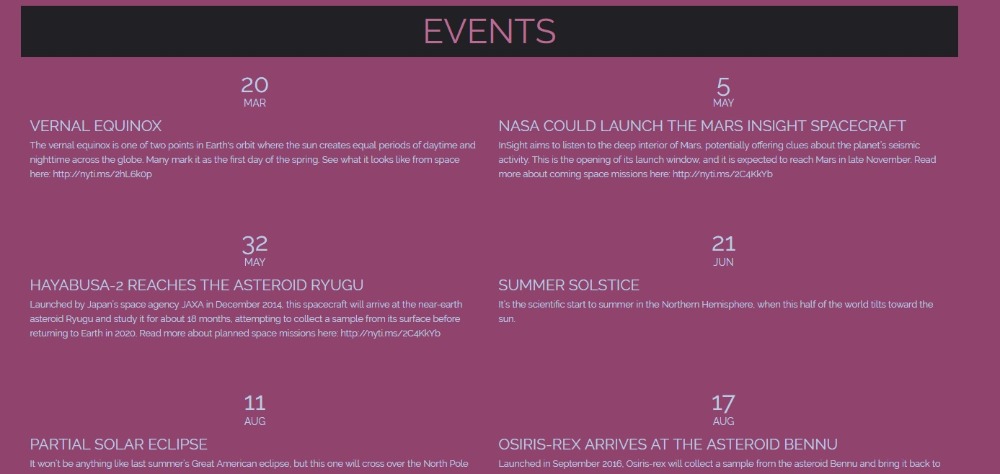

## Space View

Help users view upcoming events happening in space, current moon phase, and weather.

## Motivation

I have always had a fond interest in astronomy and space, so I wanted to make a site where I can easily view events for notable celestial events including moon phases, meteor showers, eclipses, and other interesting events.

## API Reference

The astronomical events are loaded from the New York Times Google calendar, where they track the year's biggest dates in space as they develop and update their calendar accordingly. [Find it here](https://www.nytimes.com/interactive/2018/science/astronomy-space-calendar.html#)

For the weather  [OpenWeatherMap](https://openweathermap.org)
Find location with [IP Address](https://ipinfo.io/)

